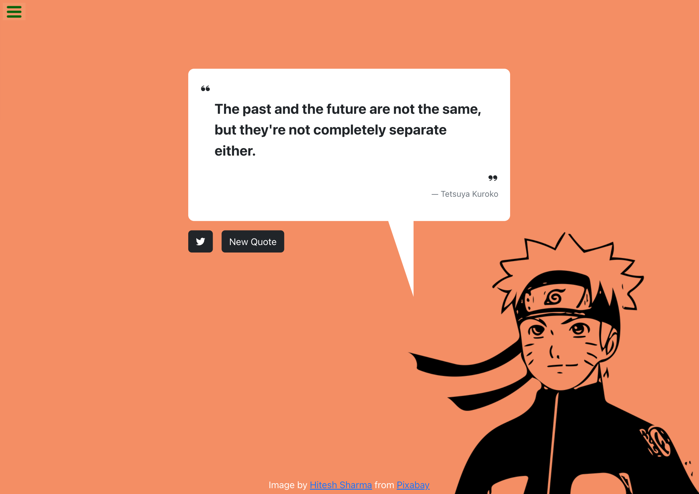

# Anime Quotes Generator

This web application is a solution to freeCodeCamp's [Random Quote Machine Challenge](https://www.freecodecamp.org/learn/front-end-development-libraries/front-end-development-libraries-projects/build-a-random-quote-machine) - you can try it out [here](https://ishmyles.github.io/random-quote-machine/).

The project was created with [Create React App](https://github.com/facebook/create-react-app).

## Available Scripts

In the project directory, you can run:

### Development

### `npm start`

Runs the app in the development mode.\
Open [http://localhost:3000](http://localhost:3000) to view it in your browser.

The page will reload when you make changes.\
You may also see any lint errors in the console.

### Deployment

### `npm run deploy`

Note: This solution was deployed with Github Pages - please see relevant documentation on how to set this up: [https://facebook.github.io/create-react-app/docs/deployment](https://create-react-app.dev/docs/deployment/#github-pages)

## Learn More

You can learn more in the [Create React App documentation](https://facebook.github.io/create-react-app/docs/getting-started).

To learn React, check out the [React documentation](https://reactjs.org/).